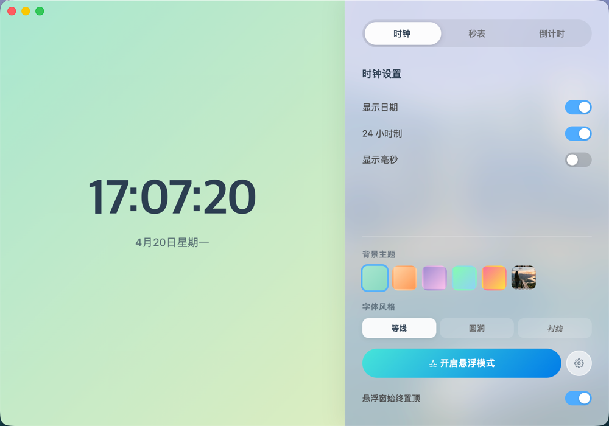
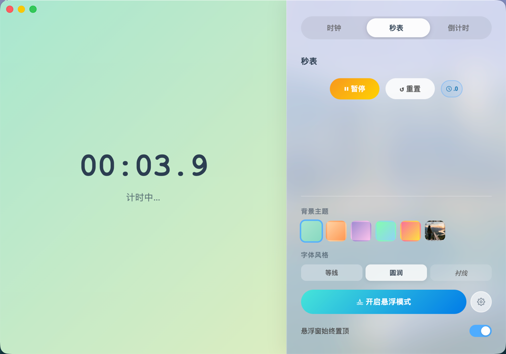
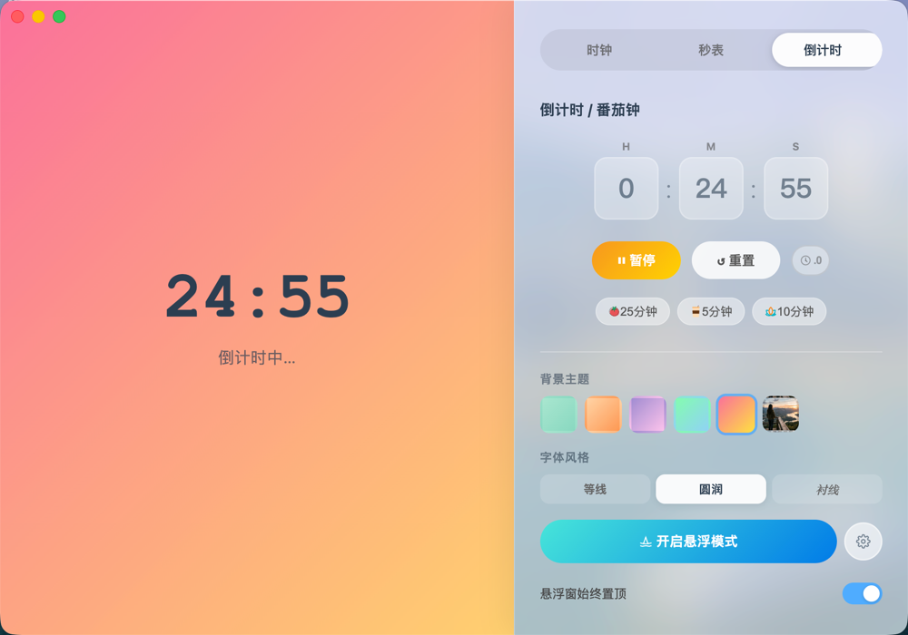
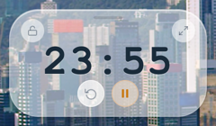

# 🕐 TimeFloating · 悬浮时钟

> 一款基于 Vue 3 + Vite + Electron 构建的桌面悬浮时钟应用，优先适配 macOS，后续支持 Windows。

---

## ✨ 项目简介

**TimeFloating** 是一款轻量、优雅的桌面时间工具。它以悬浮窗的形式常驻桌面，无论你在做什么，时间始终触手可及。除了实时时钟，还内置了秒表与倒计时（番茄钟）功能，帮助你更专注地管理时间。

应用采用双窗口架构：
- **主面板**：完整的控制与配置界面，左侧大字展示当前时间，右侧提供功能切换与个性化设置。
- **悬浮窗**：无边框透明胶囊小窗，可自由拖拽，支持锁定穿透模式，始终置顶显示在屏幕任意位置。

---

## 🚀 技术栈

| 技术 | 版本 | 用途 |
|------|------|------|
| [Vue 3](https://vuejs.org/) | ^3.5 | 前端框架 |
| [Vite](https://vitejs.dev/) | ^7.3 | 构建工具 |
| [Electron](https://www.electronjs.org/) | ^41 | 桌面应用 |
| [Vue Router](https://router.vuejs.org/) | ^5.0 | 路由管理 |
| [electron-builder](https://www.electron.build/) | ^26 | 应用打包 |

---

## ⚙️ 核心功能

### 🕰️ 时钟
- 实时显示当前时间，支持 12 / 24 小时制切换
- 显示完整日期和星期
- 可选毫秒显示
- 悬浮窗本地独立计时，避免跳秒


### ⏱️ 秒表
- 开始 / 暂停 / 重置
- RAF 驱动，毫秒精度

### ⏳ 倒计时 / 番茄钟
- 自由输入时、分、秒
- 快捷预设：🍅 25分钟 / ☕ 5分钟 / 🧘 10分钟
- 精确按结束时间戳推导

### 🎨 个性化设置
- 5 款渐变背景主题
- **自定义背景图片**：支持选择本地图片作为背景
- 字体切换：圆润 / 等线 / 衬线
- 悬浮窗不透明度调节（10%–100%）

### 🪟 悬浮模式
- 无边框 + 透明背景，毛玻璃质感
- 全局置顶显示
- **自适应窗口宽度**：根据内容自动调整尺寸
- **JS 拖拽**：主进程轮询光标坐标驱动
- **锁定模式**：鼠标事件穿透，悬停解锁
- **Hover 显示按钮**：鼠标移入显示操作按钮

### 💾 配置持久化
- 自动保存用户设置至本地
- 启动时自动恢复上次配置

---

## 🏗️ 架构说明

### 双窗口模型

```
主进程 (electron/main.js)
├── mainWindow     →  加载 /#/          (主面板)
└── floatingWindow →  加载 /#/floating  (悬浮窗)
```

### IPC 通信机制

主面板与悬浮窗通过主进程 IPC 协作：
- 主面板是计时状态的唯一权威来源
- 悬浮窗本地乐观更新 + IPC 状态校正
- 支持低频快照同步和高频 tick 推送

---

## 🛠️ 本地开发

### 环境要求
- Node.js >= 18
- macOS（主力适配平台）

### 安装运行

```bash
cd floating-clock
npm install
npm run electron:dev
```

### 测试

```bash
npm test
```

---

## 📦 打包构建

```bash
npm run electron:build
```

| 平台 | 格式 |
|------|------|
| macOS | `.dmg` + `.zip` |
| Windows | `.exe`（NSIS 安装包）+ 便携版 |

---

## 🗺️ 开发路线图

### 已完成 ✅
- [x] 主面板双栏布局（时钟 + 控制区）
- [x] 悬浮窗（无边框、透明、毛玻璃）
- [x] 秒表 & 倒计时（RAF 精确毫秒）
- [x] 番茄钟快捷预设
- [x] 背景渐变主题切换（5 种）
- [x] **自定义背景图片**
- [x] 字体切换（圆润 / 等线 / 衬线）
- [x] 配置本地持久化
- [x] 悬浮窗 JS 拖拽
- [x] **自适应窗口宽度**
- [x] **锁定穿透模式**
- [x] 悬浮窗 Hover 显示操作按钮
- [x] 悬浮窗不透明度实时调节
- [x] 倒计时整点时刻精确显示
- [x] macOS 原生毛玻璃适配
- [x] **悬浮窗锁定功能**
- [x] **倒计时与交互体验优化**

### 计划中 🎯
- [ ] 秒表计次记录
- [ ] 系统通知（倒计时结束）
- [ ] macOS 菜单栏图标模式
- [ ] 数字翻页动画
- [ ] Windows 平台适配与测试
- [ ] 多语言支持（中文 / 英文）

---

## 🔧 当前可改进点

结合当前代码结构和现有功能，项目下一阶段建议优先处理以下问题：

### 1. 代码结构偏重，维护成本会继续上升
- `src/views/MainPanel.vue` 体量过大，已同时承担 UI、计时逻辑、配置持久化、悬浮窗同步等职责
- `src/views/FloatingWindow.vue` 也存在类似问题，主面板与悬浮窗之间有较多重复逻辑
- 建议拆分为：
  - `components/`：界面组件
  - `composables/`：时钟、秒表、倒计时逻辑
  - `services/`：IPC、配置读写、窗口控制

### 2. 主面板与悬浮窗状态同步机制可继续收敛
- 当前已经实现“主面板权威状态 + 悬浮窗本地刷新”的思路，方向是对的
- 但秒表、倒计时、显示格式仍在两个视图中分别维护，后续扩展功能时容易出现边界不一致
- 建议统一状态模型和字段定义，减少双端重复推导

### 3. 配置存储方式需要正规化
- 目前配置通过 `~/.floating-clock-config.json` 直接读写
- 项目已安装 `electron-store`，但尚未接入
- 自定义背景图以 DataURL 存入配置，配置文件会持续膨胀
- 建议改为：
  - 使用 `electron-store` 管理配置
  - 增加配置版本号与默认值 schema
  - 图片只保存路径，或复制到应用数据目录后保存引用

### 4. IPC 通信层还可以更稳
- 当前 IPC 通道较分散，通信字段主要依赖字符串约定
- 当功能增多后，主进程、主面板、悬浮窗之间的维护成本会明显上升
- 建议整理统一的 IPC 常量、数据结构和事件职责

### 5. 测试覆盖不足
- 当前仅覆盖了 `src/utils/time.js` 中的时间格式化与边界处理
- 核心业务如倒计时状态切换、悬浮窗同步、配置恢复还没有自动化保障
- 后续建议至少补充：
  - 计时逻辑单元测试
  - 配置读写测试
  - IPC 同步流程测试

### 6. 跨平台准备还不充分
- 项目当前主力适配 macOS，这与现状是匹配的
- 但打包配置已经包含 Windows，而界面和窗口能力明显偏 macOS 风格
- 建议在真正推进 Windows 适配前，先梳理平台差异点，例如：
  - 毛玻璃与透明窗口表现
  - 标题栏与窗口阴影
  - 托盘/菜单栏能力差异

---

## 🚀 可拓展功能建议

### 高优先级
- 秒表计次记录（Lap）
- 倒计时结束系统通知
- 托盘 / 菜单栏常驻模式
- 悬浮窗位置记忆与启动恢复
- 开机自启动

### 中优先级
- 完整番茄钟流程（专注 / 短休息 / 长休息）
- 全局快捷键
- 更多主题、数字样式、紧凑布局
- 多显示器位置吸附与边缘贴靠

### 产品增强方向
- 专注时长统计
- 每日 / 每周番茄数据
- 多语言支持
- Windows 平台完整适配

---

## 📌 下一阶段建议顺序

如果按投入产出比排序，建议先做以下 4 项：

1. 拆分主面板与悬浮窗中的计时、配置、IPC 逻辑
2. 将配置存储迁移到 `electron-store`
3. 增加通知、托盘、位置恢复等桌面端核心能力
4. 补齐测试和平台兼容性基础

更详细的优化拆解见：

- [项目优化规划](./优化规划.md)

---

## 📄 License

MIT © TimeFloating
